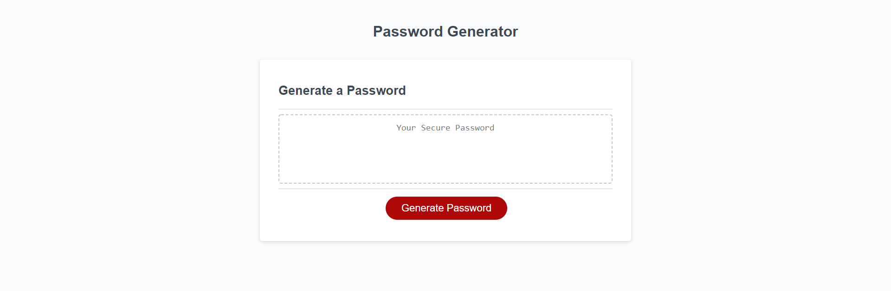

# Module #3 Challenge: Password Generator

## Description
This project is a **password generator challenge**. This challenge involved creating an application that an employee can use to generate a random password based on criteria they’ve selected, and runs in the browser. This project features dynamically updated HTML and CSS powered by JavaScript. It has a clean and responsive interface.

Implemented features:

* when the user clicks the button to generate a password, they are presented with a series of prompts for password criteria that the user can choose through
* when prompted for the length of the password, only a length of at least 8 characters and no more than 128 characters are valid
* user inputs are validated and at least one character type should be selected
* when all prompts are answered, a password is generated that matches the selected criteria and is displayed to the page

In addition, I have also:

* deployed the live [URL](https://desguerra.github.io/password-generator/)
* modified the application to resemble the mock-up functionality

Here is the link to [the completed challenge!](https://desguerra.github.io/password-generator/)

## Table of Contents

* [Screenshots](#screenshots)
* [Credits](#credits)
* [Badges](#badges)

## Screenshots

## Credits

* Starter code cloned from [here!](https://github.com/coding-boot-camp/friendly-parakeet)

## Badges

